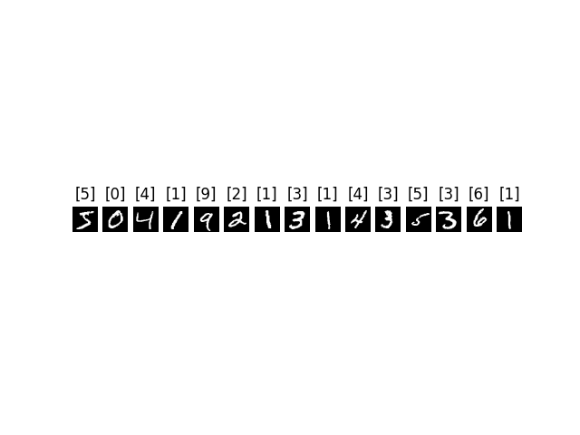
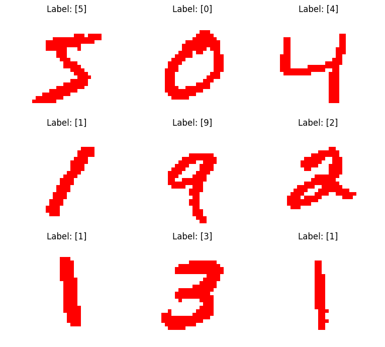

**本周工作**

摘取真实试卷的单个数字作为测试用例，测试出结果如下
```
第一轮：
实际结果：7,3,6,4,2
识别结果：2,2,2,8,2
//省略中途
第四轮：
实际结果：3，7，6，2，4
识别结果：3，3，1，1，8
```
失败原因：
mnist数据集：数字黑底白字、数字居中、无噪声、较为规范。

实际手写数字：白底红字、有噪声（边框网格等）、字体潦草有连笔



**解决办法**：
图像处理：颜色通道提取、反色、去噪等



训练结果：
```
Epoch 1, Loss: 0.07293744385242462
Epoch 2, Loss: 0.224784255027771
Epoch 3, Loss: 0.00968653429299593
Test Accuracy: 7.069
//训练发散
```

**总结**：仅通过颜色转换与模糊处理难以弥合MNIST数据与真实试卷手写数据之间的差异。
原因未知，在于两者在笔画结构、书写风格及空间分布等方面存在显著差异？
